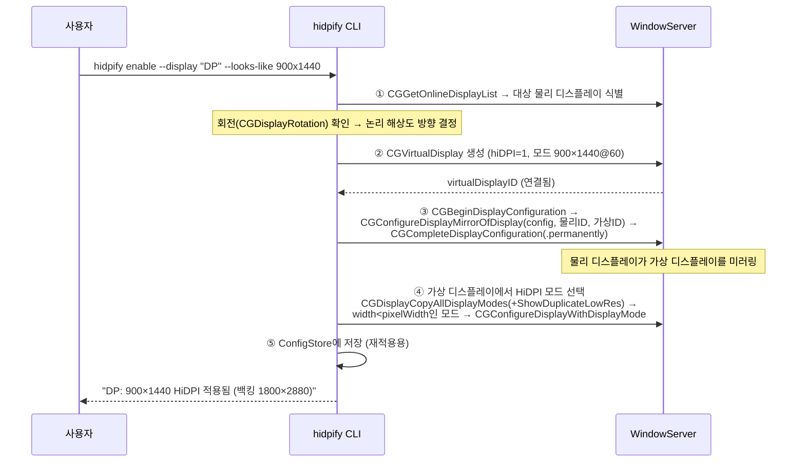

# hidpify — macOS 외장 모니터 HiDPI 강제 적용 도구 설계서

| 항목 | 내용 |
|---|---|
| 문서 버전 | 1.1 (2026-07-27) |
| 상태 | 구현 완료·실기 검증됨 |
| 대상 환경 | Apple Silicon(M4 Pro), macOS 15 Sequoia 이상 |

---

## 1. 개요

### 1.1 목적

macOS에서 HiDPI 모드를 제공하지 않는 외장 모니터/해상도에 HiDPI 렌더링을 강제 적용하는 자작 도구를 만든다. Apple의 CGVirtualDisplay private API를 런타임 introspection으로 직접 도출해, 가벼운 CLI + 상주 데몬으로 구현한다.

### 1.2 문제 정의

macOS는 텍스트를 선명하게 그리는 HiDPI(Retina) 모드를 **특정 해상도 조합에서만** 노출한다. 참조 블로그([kairoskyk, "맥북 듀얼 모니터 해상도 문제? HiDPI 설정 팁!"](https://m.blog.naver.com/kairoskyk/223336234816))가 다룬 상황이 전형적이다:

- QHD(2560×1440) 모니터에서 1920×1080을 선택하면 HiDPI 미지원 → 글자가 뿌옇게 보임
- 1280×720(HiDPI)은 선명하지만 작업 공간이 너무 좁음
- 원하는 것: **임의 해상도 × HiDPI** 조합

HiDPI의 원리: macOS가 UI를 논리 해상도의 **2배 크기 프레임버퍼**에 렌더링한 뒤 패널 해상도로 다운샘플링한다. 예를 들어 "1920×1080 HiDPI"는 내부적으로 3840×2160에 그린 후 축소 출력한다. 이 2배 백킹스토어 모드가 시스템에 열거(enumerate)되지 않으면 선택할 수 없다.

### 1.3 이 설계의 직접 타겟 (현재 장비 기준)

| 디스플레이 | 현재 상태 | 판정 |
|---|---|---|
| DELL P2725QE ×2 (4K) | 5120×2880 백킹 → "2560×1440처럼 보임" @100Hz | 이미 HiDPI 동작 중 — 조치 불필요 |
| "DP" (세로 회전 90°) | 900×1440 @1x, **HiDPI 미적용** | **주 타겟** — 1800×2880 백킹의 HiDPI 900×1440을 만들어야 함 |

### 1.4 용어

- **HiDPI 모드**: 논리 W×H, 물리(백킹) 2W×2H로 렌더링되는 디스플레이 모드
- **가상 디스플레이(virtual display)**: WindowServer가 소프트웨어로 생성하는 디스플레이. 실제 출력단(DCP 파이프)을 점유하지 않음
- **미러링**: 한 디스플레이의 콘텐츠를 다른 디스플레이에 복제 출력
- **DCP**: Apple Silicon의 Display Coprocessor. 물리 출력 모드 열거/검증을 담당

---

## 2. 기존 방식 분석

### 2.1 방법 A — 터미널 스크립트 (one-key-hidpi): 디스플레이 오버라이드 plist

블로그의 두 번째 방법. `bash -c "$(curl -fsSL https://raw.githubusercontent.com/xzhih/one-key-hidpi/master/hidpi.sh)"` 실행 후 대상 모니터 선택 → HiDPI 활성화 → 해상도 목록 선택 → 재부팅.

**동작 원리**: 모니터의 EDID에서 `DisplayVendorID`/`DisplayProductID`를 읽어

```
/Library/Displays/Contents/Resources/Overrides/
  DisplayVendorID-<vid>/DisplayProductID-<pid>   (plist)
```

에 오버라이드 파일을 생성하고, `scale-resolutions` 배열에 원하는 해상도의 2배 값(예: 1920×1080 → 3840×2160)을 바이너리 엔트리로 주입한다. WindowServer가 부팅 시 이 파일을 읽어 해당 모드를 HiDPI로 열거한다.

**한계 (불채택 사유)**:

1. **Apple Silicon에서 신뢰 불가**: M1부터 동작이 불안정했고, [M4/M5 세대에서는 완전히 무력화](https://smcleod.net/2026/03/new-apple-silicon-m4-m5-hidpi-limitation-on-4k-external-displays/)되었다. DCP 펌웨어가 자체 모드 목록으로 검증하므로 plist/소프트웨어 EDID 오버라이드를 무시한다.
2. M4/M5는 단일 스트림 출력의 서브파이프 프레임버퍼 예산이 **6720px 폭**으로 하드코딩되어(펌웨어 상수 `0x1A40`), 물리 경로로는 3840×2160@2x(7680px 폭 백킹)가 원천 차단된다. IOKit 레지스트리 쓰기(`kIOReturnUnsupported`), SkyLight private API(`SLConfigureDisplayWithDisplayMode`), 하드웨어 EDID 플래싱까지 모두 이 예산 검증에 막힌다는 것이 확인됐다.
3. 시스템 디렉터리 수정 + 재부팅 필요, 모니터별 재작업 등 UX도 나쁘다.

> 결론: **우리 장비(M4 Pro)에서는 방법 A 계열은 설계에서 제외한다.** (Intel 맥 지원이 필요해지면 부록 C의 선택 모듈로 추가 가능)

### 2.2 방법 B — 가상 디스플레이: 동작 방식 분석

물리 디스플레이의 시스템 기본 구성을 우회하는 방법에는 두 축이 있다:

1. **네이티브 유연 스케일링**: 디스플레이의 시스템 기본 구성을 직접 수정해 임의 스케일 모드를 추가. 물리 디스플레이가 허용할 때 우선 사용 (M4의 DCP 예산 안에서만 동작).
2. **가상 디스플레이 + 미러링/스트리밍**: 원하는 해상도·HiDPI의 가상 디스플레이를 만들고 그 내용을 실제 모니터로 복제. 물리 경로 제약(DCP 예산, DisplayLink, 에어플레이 등)을 **우회**한다.

이 설계는 두 번째 축을 채택한다. 근거는 Apple 자신의 CoreGraphics 프레임워크가 이미 이 메커니즘을 내장하고 있다는 사실이다 — `CGVirtualDisplay*` 계열 private API이며, Sidecar·AirPlay 같은 Apple 자체 기능이 내부적으로 이 API를 쓰는 것으로 알려져 있다. 이 API의 실제 시그니처는 Apple 프레임워크 바이너리에 대한 런타임 Objective-C introspection(`class_copyPropertyList`/`class_copyMethodList`, `Scripts/dump-private-api.swift`)으로 직접 도출했다 — 문서화되지 않은 Apple API 표면에 대한 사실 확인이며, 스크립트로 재현 가능하다.

#### 2.2.1 가상 디스플레이 생성 — CoreGraphics private API

`CGVirtualDisplay*` 계열은 CoreGraphics의 비공개 Objective-C 클래스 4종으로 구성된다 (도출된 선언은 `Sources/CHiDPIPrivate/include/CHiDPIPrivate.h` 참조):

| 클래스 | 역할 |
|---|---|
| `CGVirtualDisplayDescriptor` | 가상 디스플레이의 신원(name, vendorID, productID, serialNum), 물리 특성(sizeInMillimeters, maxPixelsWide/High), 색특성(RGB primaries, whitePoint), 이벤트 큐 |
| `CGVirtualDisplay` | `initWithDescriptor:`로 생성. 생성 즉시 시스템에 디스플레이로 등록되며 `displayID` 획득. 객체 해제 = 디스플레이 분리 |
| `CGVirtualDisplayMode` | `initWithWidth:height:refreshRate:` — 노출할 모드 1개 |
| `CGVirtualDisplaySettings` | `modes` 배열 + **`hiDPI` 플래그** → `applySettings:`로 적용 |

생성 흐름 요약(구현은 `Sources/HidpifyCore/Core/VirtualDisplayFactory.swift` 참조): descriptor에 이름·색특성(sRGB/Rec.709 원색 + D65 백색점)·최대 픽셀 크기·물리 크기(mm)·신원(serialNum/productID/vendorID)을 채운 뒤 `CGVirtualDisplay(descriptor:)`로 즉시 시스템에 연결한다. 이어서 `CGVirtualDisplaySettings`에 `hiDPI = 1`과 원하는 해상도의 `CGVirtualDisplayMode` 배열(1x·2x 모드를 함께 선언해야 HiDPI 파생이 일어남)을 채워 `applySettings:`로 반영한다.

`hiDPI = 1`이면 각 모드 W×H에 대해 시스템이 "W×H처럼 보이는" HiDPI 모드(백킹 2W×2H)와 저해상도 모드를 함께 열거한다. **가상 디스플레이는 WindowServer/GPU가 합성하므로 DCP의 물리 파이프 예산 검증을 받지 않는다** — M4에서도 임의 해상도 HiDPI가 가능한 이유.

주목할 세부 사항:

- **serialNum을 저장·재사용**: 같은 신원으로 재생성해야 macOS가 디스플레이 배치·해상도 설정을 기억한다 (FR-6).
- **잠자기 대응**: 잠자기 시 가상 디스플레이를 유지하면 깨어나기 실패/화면 배치 꼬임이 발생할 수 있어, sleep 알림에서 분리하고 wake에서 동일 신원으로 재연결하는 전략을 쓴다 (§4.6).
- **가상 여부 판별**: `CoreDisplay_DisplayCreateInfoDictionary(displayID)`의 `kCGDisplayIsVirtualDevice` 키로 판단 가능. 디스플레이 이름도 이 딕셔너리의 `DisplayProductName`에서 읽을 수 있다(본 도구는 자체 발급 vendorID로 판별한다, §4.3).
- introspection 과정에서 모드 강제 변경용 CGS private 함수(`CGSGetNumberOfDisplayModes`, `CGSConfigureDisplayMode` 등)도 함께 확인됐다 — 시스템 설정에 안 보이는 모드를 직접 지정할 때 쓸 수 있으나, 본 도구는 공개 API(`CGConfigureDisplayWithDisplayMode`)만으로 충분해 사용하지 않는다.

#### 2.2.2 미러링

미러링 구성 자체는 **공개 API로 가능**하다(`CGConfigureDisplayMirrorOfDisplay` 등, §4.4 참조). 이 도구는 이를 완전히 자동화하며, 미러링 상태 감지는 `CGDisplayIsInMirrorSet` / `CGDisplayMirrorsDisplay`로 한다. 미러링이 불가능한 대상(DisplayLink 등)을 위한 화면 캡처 기반 스트리밍은 별도 실험 기능으로 §9에서 다룬다. 직결 모니터만 대상으로 하는 기본(미러링) 경로는 화면 기록 권한이 불필요하다.

### 2.3 종합: 채택 전략

```
[물리 모니터]  ← DCP가 모드 제한 (M4: plist/EDID 무시, 파이프 예산 6720px)
      ↑ 하드웨어 미러링 (공개 API로 구성)
[가상 디스플레이]  ← CGVirtualDisplay로 임의 해상도 + hiDPI=1 생성, DCP 검증 없음
      ↑
[WindowServer가 2배 백킹에 렌더링 → 다운샘플]
```

**가상 디스플레이 생성(private API) + 미러링(공개 API) + HiDPI 모드 선택(공개 API)** 조합이 M4 세대에서 유일하게 확실한 경로이며, 이것이 본 도구의 코어다.

---

## 3. 요구사항

### 3.1 기능 요구사항

| ID | 요구사항 | 우선순위 |
|---|---|---|
| FR-1 | 연결된 디스플레이 목록과 각각의 현재 모드(해상도, 주사율, HiDPI 여부, 회전)를 출력한다 | P0 |
| FR-2 | 지정한 물리 디스플레이에 대해 "W×H처럼 보이는 HiDPI"를 한 명령으로 적용한다 (가상 디스플레이 생성 → 미러링 → 모드 선택) | P0 |
| FR-3 | 적용 해제(가상 디스플레이 제거, 미러링 해제, 원래 모드 복원)를 한 명령으로 수행한다 | P0 |
| FR-4 | 회전(세로 모니터, 90°/270°)된 디스플레이를 지원한다 — 회전 반영된 논리 해상도로 가상 모드를 구성 | P0 (주 타겟이 세로 모니터) |
| FR-5 | 구성을 파일로 저장하고, 로그인/모니터 재연결/잠자기 복귀 시 자동 재적용한다 (상주 데몬 + LaunchAgent) | P1 |
| FR-6 | 가상 디스플레이 신원(serialNum)을 저장·재사용하여 macOS의 배치·설정 기억이 유지되게 한다 | P1 |
| FR-7 | 임의 해상도 지정(모니터 화면비 기준 배수 목록 자동 생성 포함)을 지원한다 | P2 |

### 3.2 비기능 요구사항

| ID | 요구사항 |
|---|---|
| NFR-1 | 화면 기록·접근성 등 TCC 권한을 요구하지 않는다 (하드웨어 미러링만 사용) |
| NFR-2 | SIP 해제, 시스템 파일 수정, 재부팅을 요구하지 않는다 |
| NFR-3 | 데몬 상주 메모리 < 30MB, 유휴 CPU ≈ 0% (이벤트 구동, 폴링 금지) |
| NFR-4 | macOS 15(Sequoia) / Apple Silicon 우선. private API 시그니처 변화에 대비해 런타임 클래스 존재 검사 후 우아하게 실패 |
| NFR-5 | 단일 바이너리 배포 (Swift Package Manager, 외부 런타임 의존성 없음) |

### 3.3 비목표 (Non-goals)

- DDC 밝기 제어, HDR/XDR, PIP 등 부가 기능
- DisplayLink/AirPlay 등 캡처 스트리밍이 필요한 대상 (직결 모니터만)
- Intel 맥의 plist 방식 자동화 (필요 시 부록 C대로 확장)
- App Store 배포 (private API 사용으로 원천 불가 — 개인 도구)

---

## 4. 설계

### 4.1 기술 스택 및 형태

- **언어**: Swift 5.9+ (SPM 실행 타깃), private API 선언은 별도 C 타깃(`Sources/CHiDPIPrivate/include/CHiDPIPrivate.h`)의 우산 헤더로 노출 — Apple CoreGraphics 프레임워크를 런타임 introspection(`Scripts/dump-private-api.swift`)으로 직접 도출한 시그니처
- **형태**: 단일 CLI `hidpify` + 동일 바이너리의 `daemon` 서브커맨드를 LaunchAgent로 상주
  - 1단계는 CLI만으로 완결 (메뉴바 앱은 로드맵의 선택 항목)
- **의존성**: 없음 (Apple 시스템 프레임워크만 사용, 원격 SPM 의존성 0개)

> **왜 CLI 우선인가**: "직접 만들어 쓰는" 도구의 요구는 ①한 번 설정 ②자동 유지다. 둘 다 GUI가 필요 없고, CLI+데몬이 코드량이 가장 적고 검증이 쉽다.

### 4.2 모듈 구조

```
Sources/CHiDPIPrivate/
└── include/CHiDPIPrivate.h     # private 클래스 선언 (런타임 introspection으로 도출, Scripts/dump-private-api.swift)
Sources/hidpify/
├── main.swift                  # 자체 인자 파서 엔트리 (list/enable/disable/status/daemon/install)
├── Core/
│   ├── DisplayEnumerator.swift # CGGetOnlineDisplayList + 이름/가상여부/회전/모드 조회
│   ├── VirtualDisplayFactory.swift # descriptor 구성 → CGVirtualDisplay 생성/설정
│   ├── MirrorController.swift  # CGConfigureDisplayMirrorOfDisplay 래핑
│   ├── ModeSelector.swift      # HiDPI 모드 열거·선택 (CGDisplayCopyAllDisplayModes)
│   └── SessionModel.swift      # "물리 디스플레이 1개 ↔ 가상 1개 ↔ 미러링" 단위의 상태
├── Persistence/
│   └── ConfigStore.swift       # ~/.config/hidpify/config.json (대상 식별자, 해상도, serialNum)
└── Daemon/
    ├── DaemonRunner.swift      # RunLoop + 재구성/잠자기 이벤트 → 재적용
    └── LaunchAgentInstaller.swift # ~/Library/LaunchAgents/dev.irae.hidpify.plist 설치/제거
```

### 4.3 핵심 데이터 모델

```swift
struct TargetConfig: Codable {
    let displayMatcher: DisplayMatcher  // vendorID+productID+serialNumber(EDID), 이름은 표시용
    let looksLike: Size                 // 논리 해상도 (회전 반영 전 기준: 가로 기준 W×H)
    let refreshRate: Double             // 기본 60
    var virtualSerialNum: UInt32        // 최초 생성 시 랜덤 → 고정 (FR-6)
}
```

물리 디스플레이 식별은 `CGDisplayVendorNumber/ModelNumber/SerialNumber` 조합으로 한다. displayID는 재연결 시 바뀌므로 저장하지 않는다.

### 4.4 핵심 흐름 — `hidpify enable`



각 단계에서 쓰는 API의 공개/비공개 구분:

| 단계 | API | 구분 |
|---|---|---|
| ① 열거/식별 | `CGGetOnlineDisplayList`, `CGDisplayVendorNumber` 등, `CoreDisplay_DisplayCreateInfoDictionary`(이름) | 공개 + 준공개 1개 |
| ② 가상 디스플레이 | `CGVirtualDisplay*` 4종 | **private** (유일한 private 의존) |
| ③ 미러링 | `CGBeginDisplayConfiguration`, `CGConfigureDisplayMirrorOfDisplay`, `CGCompleteDisplayConfiguration` | 공개 (문서화됨) |
| ④ 모드 선택 | `CGDisplayCopyAllDisplayModes` + `kCGDisplayShowDuplicateLowResolutionModes`, `CGConfigureDisplayWithDisplayMode` | 공개 |

HiDPI 모드 판별: `CGDisplayModeGetWidth(mode) < CGDisplayModeGetPixelWidth(mode)` (논리<물리 → 2x 백킹).

### 4.5 회전(세로 모니터) 처리 — FR-4

주 타겟 "DP" 디스플레이는 90° 회전 상태(논리 900×1440)다. 회전은 **물리 디스플레이 속성**이고 미러 소스(가상)에는 회전 개념을 넣지 않는다:

1. `CGDisplayRotation(물리ID)`로 회전 확인 (90/270이면 세로)
2. 가상 디스플레이 모드는 **회전이 반영된 논리 방향**으로 생성: 900×1440 (백킹 1800×2880)
3. 미러링 시 WindowServer가 소스→타깃 스케일 매핑을 수행. 화면비가 동일(5:8)하므로 레터박스 없음

프로토타입 단계에서 실기기로 검증할 1순위 항목이다 (§7).

### 4.6 데몬 설계 — FR-5

이벤트 구동으로만 동작 (NFR-3):

| 이벤트 | 소스 | 동작 |
|---|---|---|
| 디스플레이 재구성 | `CGDisplayRegisterReconfigurationCallback` | 대상 물리 디스플레이 등장 → 세션 재적용 / 소멸 → 가상 정리 |
| 잠자기 진입 | `NSWorkspace.screensDidSleepNotification` | 가상 디스플레이 분리 (잠자기 중 유지 시 발생하는 깨어나기 실패·배치 꼬임 회피) |
| 깨어남 | `NSWorkspace.screensDidWakeNotification` | 동일 serialNum으로 재생성 → 미러링·모드 재적용 |
| SIGTERM | signal handler | 가상 정리 후 종료 (미러링 해제 → 물리 원복) |

재적용은 멱등(idempotent)으로 설계한다: 현재 상태를 읽고 목표 상태와 다를 때만 변경. 재구성 콜백은 자기 자신이 유발한 변경에도 호출되므로 디바운스(예: 1초) + "적용 중" 플래그로 루프를 차단한다.

### 4.7 CLI 인터페이스

```
hidpify list                          # 디스플레이 표: ID, 이름, 모드, HiDPI 여부, 회전, 가상 여부
hidpify enable [--display <이름|인덱스>] [--looks-like WxH] [--hz N]
                                    # 미지정 시: 비-HiDPI 디스플레이 자동 선택, 현재 논리 해상도 사용
hidpify disable [--display ...]       # 미러 해제 → 가상 제거 → 원래 모드 복원
hidpify status                        # 활성 세션, 데몬 동작 여부
hidpify daemon                        # (LaunchAgent가 실행) 상주 모드
hidpify install-agent / uninstall-agent
```

디폴트 동작을 사용자의 실제 상황에 맞춘다: 인자 없이 `hidpify enable`만 치면 "HiDPI가 아닌 물리 디스플레이"(현재 DP 모니터)를 찾아 현재 논리 해상도 그대로 HiDPI화한다.

### 4.8 오류 처리 원칙

- `CGVirtualDisplay` 클래스가 `NSClassFromString`으로 조회되지 않으면(OS 업데이트로 제거) 즉시 명확한 메시지와 함께 중단 (NFR-4)
- `applySettings`/미러링 실패 시 생성한 가상 디스플레이를 반드시 해제(객체 소멸 = 분리)하고 물리 모드 원복 — 절반 적용 상태 금지
- 데몬은 적용 실패 시 지수 백오프(최대 30초)로 3회 재시도 후 로그만 남기고 대기 (재구성 이벤트가 오면 다시 시도)

---

### 4.9 프로세스 수명과 명령 의미론 (구현 중 보완)

`CGVirtualDisplay`는 **생성한 프로세스가 객체를 유지하는 동안만 존재**한다(해제 = 디스플레이 분리). 따라서 일회성 CLI 프로세스가 적용 상태를 남길 수 없고, 명령 의미를 다음과 같이 정한다:

- `hidpify enable` = **설정 저장 + 적용 프로세스 기동**. LaunchAgent가 설치되어 있으면 `launchctl kickstart -k`로 데몬을 재시작해 적용하고, 없으면 현재 프로세스가 포그라운드 데몬으로 전환해 유지한다(Ctrl-C 시 원복 후 종료). 영구 적용은 `hidpify install-agent`.
- `hidpify disable` = 설정에서 제거 + 데몬 재시작(재시작된 데몬은 설정에 없는 세션을 걷어냄).
- 데몬 설정 반영은 재시작 방식으로 단순화한다(파일 워처 불필요, 재시작 시 화면이 잠깐 깜빡이는 것은 허용).

## 5. 리스크와 완화

| # | 리스크 | 가능성 | 완화 |
|---|---|---|---|
| R1 | private API(`CGVirtualDisplay*`)가 향후 macOS에서 변경·제거 | 중 | 런타임 존재 검사(NFR-4). 이 API는 Sidecar/AirPlay가 내부적으로 쓰는 인프라라 급격한 제거 가능성은 낮음. 제거되면 `Scripts/dump-private-api.swift`로 신규 시그니처를 재덤프해 추종 |
| R2 | 미러링 조합에서 커서 잔상/색 깜빡임/절전 문제 (알려진 트레이드오프) | 중 | sleep 시 분리·wake 시 재생성 전략(§4.6). 문제 지속 시 임시 가상 디스플레이를 짧게 생성했다 해제하는 워크어라운드 추가 검토 |
| R3 | 회전된 물리 디스플레이로의 미러링 매핑이 기대와 다름 | 중 | M1 프로토타입에서 최우선 검증. 실패 시 대안: 가상을 주 방향(1440×900)으로 만들고 물리 회전을 0으로 되돌린 뒤 가상 쪽 배치로 해결 |
| R4 | 미러 세트 구성 시 macOS가 배치/주 디스플레이 설정을 흔듦 | 중 | serialNum 고정(FR-6)으로 시스템이 설정을 기억하게 함. `.permanently` 스코프 사용 |
| R5 | 가상 디스플레이 합성으로 GPU 부하 증가 | 낮 | 1800×2880 1장 수준은 M4 Pro에서 무시 가능. 측정만 해둠 |
| R6 | 100Hz 물리 패널 ↔ 60Hz 가상 소스의 주사율 불일치 | 낮 | 가상 모드에 물리 패널 주사율도 같이 노출(`--hz`), 기본은 물리 현재값을 따름 |
| R7 | **(확인됨)** 미러 세트에서 Spaces 전환 제스처/단축키 미동작 — Sidecar·DisplayLink·AirPlay 공통의 알려진 macOS 동작 | 발생 중 | 도구 차원 해결 불가. 우회: Mission Control 경유 클릭, 또는 "디스플레이별 개별 공간" 끄기. 근본 해결은 스트리밍 모드(화면 기록 권한 필요)뿐이라 v1 비목표 유지, v2 후보 |

---

## 6. 구현 로드맵

| 마일스톤 | 내용 | 완료 기준 |
|---|---|---|
| M1 — 스파이크 | private 헤더 + 가상 디스플레이 1개 생성/해제만 하는 최소 실행 파일 | `hidpify list`에 가상 디스플레이가 HiDPI 모드로 보임. **DP 모니터 미러링을 수동(시스템 설정)으로 걸어 화질 개선 육안 확인** |
| M2 — 코어 | enable/disable/list/status 완성 (미러링·모드 선택 자동화, 회전 처리) | `hidpify enable` 한 방에 DP 모니터가 900×1440 HiDPI로 전환, `disable`로 완전 원복 |
| M3 — 상주 | ConfigStore + daemon + LaunchAgent | 재부팅/케이블 재연결/잠자기 후 자동 복원 |
| M4 — 다듬기 (선택) | 임의 해상도 배수 목록(FR-7), 메뉴바 앱 래퍼 | — |

M1을 가장 앞에 둔 이유: 이 설계의 유일한 불확실성(private API 동작, 회전 미러링)을 코드 100줄 이내로 조기 검증하기 위함이다.

## 7. 검증 계획

- **M1 검증**: 가상 디스플레이 생성 → `system_profiler SPDisplaysDataType`에서 "UI Looks like" 확인 → DP 모니터에 미러 → 텍스트 선명도 스크린샷 비교(1x vs 2x)
- **M2 검증**: enable→disable 사이클 10회 후 디스플레이 배치가 원래대로인지, 좀비 가상 디스플레이가 없는지 (`hidpify list`)
- **M3 검증**: ①잠자기→깨어남 ②케이블 분리→재연결 ③재로그인, 각각 자동 복원 확인. 데몬 CPU/메모리 Activity Monitor 확인 (NFR-3)

---

## 8. 메뉴바 앱 (UI 확장)

### 8.1 형태와 프로세스 아키텍처

- **형태**: 메뉴바 상주 앱 (SwiftUI `MenuBarExtra`, `.menuBarExtraStyle(.window)` 팝오버). Dock 아이콘 없음(`LSUIElement`).
- **원칙 — 앱은 순수 프론트엔드**: 가상 디스플레이 세션의 소유자는 여전히 데몬 하나뿐이다. 앱은 ① 디스플레이 상태 읽기(공개 API, 읽기 전용) ② 설정 편집(`ConfigStore`) ③ 데몬 제어(`launchctl kickstart`/`install-agent`)만 수행한다. CLI와 완전히 동일한 제어 경로를 쓰므로 앱·CLI·데몬이 충돌 없이 공존한다.
- **상태 갱신**: `CGDisplayRegisterReconfigurationCallback`으로 디스플레이 변화를 구독해 팝오버를 라이브 갱신.

### 8.2 패키지 재구성

```
targets:
  HidpifyCore   (library)  ← Core/·Persistence/·Daemon/ 전부 이동
  hidpify       (CLI)      ← main.swift만, HidpifyCore 의존
  HidpifyApp    (app 실행 파일) ← SwiftUI, HidpifyCore 의존
```

SPM은 .app 번들을 만들지 못하므로 `Scripts/make-app.sh`가 번들 조립(실행 파일 + Info.plist + 아이콘, ad-hoc 서명)을 담당한다.

### 8.3 v1 기능 (팝오버)

| 영역 | 내용 |
|---|---|
| 헤더 | 앱 이름 + 데몬 상태 표시(실행 중/중지) |
| 디스플레이 카드 | 물리 디스플레이별: 이름, 현재 모드(해상도·Hz·HiDPI 여부), HiDPI 토글 |
| 해상도 선택 | 토글 ON 시 looks-like 드롭다운 — 화면비 사다리 + **밀도 일치 제안**("1278×2272 — matches DELL density") |
| 푸터 | Start at Login 토글(LaunchAgent install/uninstall), Quit |

밀도 일치 제안을 위해 `DisplayEnumerator`에 물리 크기(`CGDisplayScreenSize`)·논리 PPI 필드를 추가하고, 후보 생성 유틸(`ResolutionAdvisor`)을 Core에 신설한다. UI 문구는 영어(공개 배포 대비).

### 8.4 비목표 (v1)

- 앱 단독 세션 소유(데몬 대체), DDC 제어, 밝기/회전 제어, 설정 창, 자동 업데이트

## 9. 스트리밍 모드 (실험적 / experimental)

> **상태(2026-07-27): 실험 기능으로 확정.** 스와이프·선명도·색상은 동작하지만, 물리 디스플레이가 배치에 "유령 데스크탑"으로 남는 구조적 한계가 있다 — 전체화면 앱(원격 데스크탑 등)과 함께 쓰면 내용이 남고, 미션 컨트롤/스크린샷에 유령이 보이며, 완전 제거는 공개 API로 불가능(§9.5). 게다가 ad-hoc 서명이라 재빌드마다 화면 기록 권한 재부여가 필요하다. **기본·권장은 미러링**이고, 스트리밍은 "Spaces 스와이프가 꼭 필요한 비전체화면 작업"용 opt-in으로만 노출한다. CLI/앱에 experimental 경고를 표시한다.

### 9.1 목적과 토폴로지

미러 세트에서 Spaces 전환 제스처가 동작하지 않는 macOS 버그(R7)의 근본 해결 옵션. **기본값은 미러링**이며, 스트리밍은 디스플레이별 opt-in.

```
[미러링(기본)]  가상(마스터) ←하드웨어 미러─ 물리    · 권한 불요 · Spaces 제스처 불가(R7)
[스트리밍(옵션)] 가상(독립 확장 디스플레이) ─SCStream 캡처→ 물리의 전면 플레이어 윈도우
                · 가상이 미러 세트가 아니므로 Spaces 제스처 정상 · 화면 기록 권한 필요
```

### 9.2 파이프라인

1. 가상 디스플레이 생성(기존과 동일, hiDPI 모드 선택 포함) — 단, 미러링하지 않음
2. **배치 교환**: 가상 디스플레이를 물리 디스플레이가 있던 arrangement 위치로, 물리는 원격 코너(대각 인접)로 이동 (`CGConfigureDisplayOrigin`, 공개 API) — 커서 동선이 자연스럽게 가상을 향하게
3. 물리 디스플레이를 네이티브 해상도 모드로 전환(스트림 픽셀과 1:1에 가깝게)
4. `SCStream`(ScreenCaptureKit)으로 가상 디스플레이 캡처: BGRA, `minimumFrameInterval` = 물리 주사율, `showsCursor: true`, queueDepth 5
5. 물리 스크린 위 **플레이어 윈도우**: borderless NSWindow, `collectionBehavior = [.canJoinAllSpaces, .stationary, .fullScreenAuxiliary]`, 프레임의 IOSurface를 `CALayer.contents`에 직결(제로카피), `contentsGravity = .resize`

데몬 프로세스가 스트림·윈도우를 소유한다(가상 디스플레이와 동일 수명). 데몬은 CLI 바이너리이므로 윈도우 생성 전 `NSApplication.shared` 초기화 + `.prohibited` 활성화 정책.

### 9.3 권한 흐름

- Screen Recording(TCC)은 **hidpify 바이너리**에 부여됨 — CLI와 데몬이 같은 바이너리라 한 번 허가로 공유. 앱(HidpifyApp)은 설정만 쓰므로 권한 불요
- `enable --mode stream` 시 CLI가 `CGPreflightScreenCaptureAccess()` 확인 → 없으면 `CGRequestScreenCaptureAccess()`로 요청 후 안내 출력
- **데몬 폴백 규칙**: 적용 시점에 권한이 없으면 스트리밍 대신 미러링으로 폴백하고 경고 로그 (죽은 화면 금지 — §4.8 연장)
- ad-hoc 서명 바이너리 특성상 재빌드 시 TCC 재허가가 필요할 수 있음(문서화)

### 9.4 설정 스키마

`TargetConfig`에 `mode: ScalingMode`(`"mirror"`/`"stream"`, String enum) 추가. 기존 설정 파일과의 하위호환을 위해 디코딩 시 필드 부재면 `.mirror`. CLI `--mode`, 앱은 카드 내 세그먼트 컨트롤로 노출.

### 9.5 알려진 트레이드오프 (문서화 대상)

- 물리 디스플레이 자체의 데스크탑이 플레이어 뒤에 숨어 존재(유령 데스크탑). **완화책(구현됨)**: 물리 디스플레이를 배치 맨 아래로 큰 간격(8000pt)을 두고 밀어 **어떤 디스플레이와도 모서리가 닿지 않는 "고립 섬"**으로 만든다. macOS는 인접하지 않은 디스플레이로 커서가 넘어가지 못하므로, 유령 데스크탑이 커서로 도달 불가능해지고 일상 화면에서 안 보인다(미션컨트롤/전체 스크린샷에는 여전히 나타남). `remoteIslandOrigin(excluding:)` 참조. 완전 제거는 물리 디스플레이를 배치에서 숨기는 확실한 공개 API가 없어 비목표.
- 캡처→합성 경로가 미러링보다 GPU/전력 소모 큼, 프레임 지연 1~2프레임
- 잠자기/스트림 오류 시: 스트림 정지·윈도우 정리 후 기존 세션 수명주기와 동일하게 재생성, SCStream 오류는 지수 백오프 재시도

NFR-1은 다음과 같이 갱신된다: "기본(미러링) 경로는 TCC 권한을 요구하지 않는다. 화면 기록 권한은 사용자가 스트리밍 모드를 명시적으로 선택한 경우에만 요청한다."

## 10. 배치 보존 (Arrangement preservation)

### 10.1 문제

가상 디스플레이 생성/제거, 미러 세트 구성, 스트림의 섬 이동(§9.5)은 모두 `CGConfigureDisplayOrigin`/디스플레이 추가를 유발하고, macOS는 그때마다 배치 전체를 재정규화한다. 기존 구현은 **조작 대상 물리 디스플레이의 origin만** 저장·복원해서, 나머지 실제 디스플레이(예: 다른 모니터들)가 밀린 채 방치됐다. 결과: enable/disable/모드전환마다 사용자가 수동 재정렬해야 함.

### 10.2 설계 — 기준선 스냅샷 & 복원 (앵커 상대 좌표)

> **핵심(v2, 2026-07-27)**: macOS는 디스플레이 추가/이동 시 좌표 원점을 재정규화하므로 **절대 origin은 불변이 아니다**(초기 구현이 이걸 놓쳐 스트림 완전 깨짐·미러 어긋남 발생). 그래서 기준선을 **앵커(hidpify가 안 건드리는 실제 디스플레이) 대비 상대 오프셋**으로 저장하고, 복원 시 앵커의 *현재* 위치를 기준으로 절대 목표를 재계산한다. 또한 **미러 세트는 마스터(가상)의 origin으로 배치**되므로, 미러 모드에선 슬레이브(물리)가 아니라 마스터를 목표 위치에 놓는다.

- **기준선(baseline)**: 세션이 하나도 없는 "깨끗한" 상태에서 `{anchor: matcher, relatives: matcher→(origin−anchorOrigin)}`. 앵커는 `CGMainDisplayID`(단, 설정 타겟은 회피). `~/.config/hidpify/arrangement.json`에 영속.
- **복원**: 앵커가 현재 어디 있든 그 위치 + 상대 오프셋으로 각 실제 디스플레이를 재배치. 앵커 자신은 (0,0)이라 스킵. 미러 물리 슬레이브는 `except`로 제외(마스터로 이동됨).
- **캡처 시점**: 데몬 시작 시 첫 reapply **전에**, 그리고 재구성 콜백에서 **세션이 비어있고 가상 디스플레이(vendor 0x4849)가 하나도 온라인이 아닐 때만**. 세션 활성 중에는 절대 캡처하지 않는다(섬 위치를 기준선으로 오염시키면 안 됨).
- **복원**: `restoreRealDisplaysToBaseline(except:)` — 현재 온라인인 실제 디스플레이를 기준선 origin으로 일괄 설정(한 트랜잭션). `except`에 든 것은 제외.
  - **mirror enable 후**: 전체 복원(가상은 미러 마스터라 슬롯 무관).
  - **stream enable 후**: 가상→물리의 기준선 슬롯, 물리→섬 이동 후, `except:[물리 id]`로 나머지 복원(물리는 섬 유지).
  - **disable 후**: 물리 포함 전체 복원.
- 복원이 유발하는 재구성 콜백은 멱등 reapply + "세션 활성 중 캡처 금지" 가드로 루프 차단.

## 부록 A. 참고 자료

- 참조 블로그: [맥북 듀얼 모니터 해상도 문제? HiDPI 설정 팁! (kairoskyk)](https://m.blog.naver.com/kairoskyk/223336234816)
- private API 도출 방법: `Scripts/dump-private-api.swift` — Apple CoreGraphics 프레임워크를 Objective-C 런타임 introspection으로 직접 덤프해 재현 가능한 방식으로 시그니처를 확보한다.
- [one-key-hidpi (터미널 스크립트 방식)](https://github.com/xzhih/one-key-hidpi)
- [M4/M5 4K HiDPI 제약 분석 (smcleod.net)](https://smcleod.net/2026/03/new-apple-silicon-m4-m5-hidpi-limitation-on-4k-external-displays/) — DCP 파이프 예산, 가상 디스플레이 우회 확인

## 부록 B. private API 전체 시그니처

Apple CoreGraphics 프레임워크를 런타임 introspection(`class_copyPropertyList`/`class_copyMethodList`, `Scripts/dump-private-api.swift`로 재현 가능)해 도출한 선언. 실제 선언 전문은 `Sources/CHiDPIPrivate/include/CHiDPIPrivate.h`를 근거로 한다 (아래는 요약):

```objc
@interface CGVirtualDisplayDescriptor : NSObject
@property(retain, nonatomic) id queue;
@property(retain, nonatomic) NSString *name;
@property(nonatomic) CGPoint whitePoint, redPrimary, greenPrimary, bluePrimary;
@property(nonatomic) unsigned int maxPixelsWide, maxPixelsHigh;
@property(nonatomic) CGSize sizeInMillimeters;
@property(nonatomic) unsigned int serialNum, productID, vendorID;
- (id)init;
@end

@interface CGVirtualDisplay : NSObject
@property(readonly, nonatomic) unsigned int displayID;
- (id)initWithDescriptor:(CGVirtualDisplayDescriptor *)descriptor;
- (BOOL)applySettings:(id)settings;
@end

@interface CGVirtualDisplayMode : NSObject
@property(readonly, nonatomic) unsigned int width, height;
@property(readonly, nonatomic) double refreshRate;
- (id)initWithWidth:(unsigned int)width height:(unsigned int)height refreshRate:(double)refreshRate;
@end

@interface CGVirtualDisplaySettings : NSObject
@property(nonatomic) unsigned int hiDPI;   // 1 = HiDPI 모드 열거
@property(retain, nonatomic) NSArray *modes;
- (id)init;
@end
```

## 부록 C. (선택) Intel 맥 확장 — plist 오버라이드 모듈

Intel 맥 지원이 필요해질 경우: `ioreg`로 EDID vendor/product 추출 → `/Library/Displays/.../Overrides/DisplayVendorID-*/DisplayProductID-*` plist에 `scale-resolutions`(2배 해상도, 4바이트 BE 폭 + 4바이트 BE 높이 + 플래그) 주입 → 재부팅. one-key-hidpi의 로직과 동일하며, `hidpify enable --method plist`로 노출한다. Apple Silicon에서는 이 경로를 차단(에러 안내)한다.
