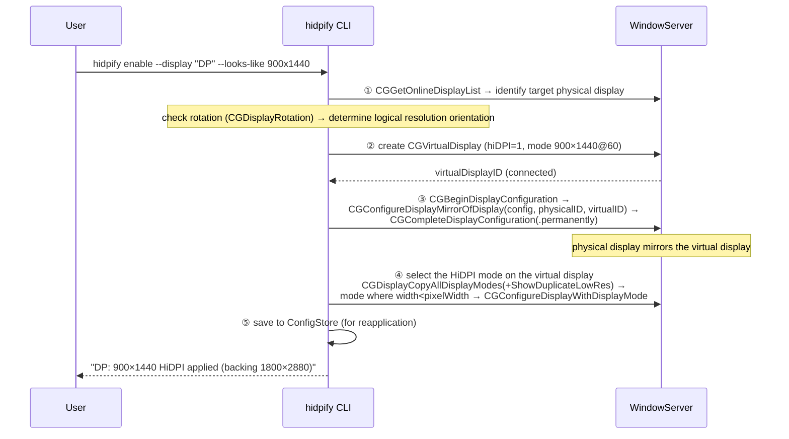

**English** · [한국어](./DESIGN.ko.md)

# hidpify — macOS External Monitor HiDPI Forcing Tool Design Document

| Item | Value |
|---|---|
| Document version | 1.1 (2026-07-27) |
| Status | Implementation complete, verified on real hardware |
| Target environment | Apple Silicon (M4 Pro), macOS 15 Sequoia or later |

---

## 1. Overview

### 1.1 Purpose

Build a custom tool that forces HiDPI rendering on external monitors/resolutions for which macOS does not natively offer a HiDPI mode. The tool derives Apple's `CGVirtualDisplay` private API directly via runtime introspection and implements it as a lightweight CLI plus a resident daemon.

### 1.2 Problem Statement

macOS only exposes HiDPI (Retina) mode — which renders text sharply — for **specific resolution combinations**. The situation covered by the reference blog post ([kairoskyk, "MacBook dual-monitor resolution problem? HiDPI setup tips!"](https://m.blog.naver.com/kairoskyk/223336234816)) is typical:

- On a QHD (2560×1440) monitor, selecting 1920×1080 gives no HiDPI support → text looks blurry
- 1280×720 (HiDPI) is sharp but the workspace is far too cramped
- What's actually wanted: **an arbitrary resolution × HiDPI** combination

The principle behind HiDPI: macOS renders the UI into a framebuffer **twice the size of the logical resolution**, then downsamples it to the panel resolution. For example, "1920×1080 HiDPI" is internally drawn at 3840×2160 and then scaled down for output. If this 2x backing-store mode is not enumerated by the system, it cannot be selected.

### 1.3 Direct Target of This Design (current hardware)

| Display | Current state | Verdict |
|---|---|---|
| DELL P2725QE ×2 (4K) | 5120×2880 backing → "looks like 2560×1440" @100Hz | Already running HiDPI — no action needed |
| "DP" (rotated 90°, portrait) | 900×1440 @1x, **HiDPI not applied** | **Primary target** — need to produce a HiDPI 900×1440 with 1800×2880 backing |

### 1.4 Terminology

- **HiDPI mode**: a display mode rendered at logical W×H with a physical (backing) resolution of 2W×2H
- **Virtual display**: a display WindowServer creates in software. Does not occupy an actual output port (DCP pipe)
- **Mirroring**: replicating the content of one display onto another display's output
- **DCP**: Apple Silicon's Display Coprocessor. Responsible for enumerating/validating physical output modes

---

## 2. Analysis of Existing Approaches

### 2.1 Approach A — Terminal script (one-key-hidpi): display override plist

The blog's second method. Run `bash -c "$(curl -fsSL https://raw.githubusercontent.com/xzhih/one-key-hidpi/master/hidpi.sh)"`, select the target monitor → enable HiDPI → pick a resolution from the list → reboot.

**How it works**: read the monitor's `DisplayVendorID`/`DisplayProductID` from its EDID, then create an override file at

```
/Library/Displays/Contents/Resources/Overrides/
  DisplayVendorID-<vid>/DisplayProductID-<pid>   (plist)
```

and inject the 2x value of the desired resolution (e.g. 1920×1080 → 3840×2160) into the `scale-resolutions` array as a binary entry. WindowServer reads this file at boot and enumerates that mode as HiDPI.

**Limitations (reason not adopted)**:

1. **Not reliable on Apple Silicon**: behavior has been flaky since M1, and it was [completely neutralized on the M4/M5 generation](https://smcleod.net/2026/03/new-apple-silicon-m4-m5-hidpi-limitation-on-4k-external-displays/). The DCP firmware validates against its own mode list, so plist/software EDID overrides are ignored.
2. On M4/M5, the sub-pipe framebuffer budget for a single-stream output is hardcoded to a **6720px width** (firmware constant `0x1A40`), so 3840×2160@2x (7680px-wide backing) is fundamentally blocked on the physical path. It was confirmed that IOKit registry writes (`kIOReturnUnsupported`), the SkyLight private API (`SLConfigureDisplayWithDisplayMode`), and even hardware EDID flashing are all stopped by this same budget check.
3. UX is also poor: requires modifying system directories, rebooting, and redoing the process per monitor.

> Conclusion: **on our hardware (M4 Pro), Approach A and its family are excluded from this design.** (If Intel Mac support is later needed, it can be added as an optional module per Appendix C.)

### 2.2 Approach B — Virtual display: how it works

There are two axes for working around a physical display's default system configuration:

1. **Native flexible scaling**: directly modify the display's default system configuration to add an arbitrary scale mode. Preferred whenever the physical display allows it (only works within the M4's DCP budget).
2. **Virtual display + mirroring/streaming**: create a virtual display at the desired resolution and HiDPI, then replicate its content onto the real monitor. This **bypasses** physical-path constraints (DCP budget, DisplayLink, AirPlay, etc.).

This design adopts the second axis. The rationale is that Apple's own CoreGraphics framework already embeds this mechanism — the `CGVirtualDisplay*` family of private APIs — which is known to be used internally by Apple's own features such as Sidecar and AirPlay. The actual signatures of this API were derived directly via runtime Objective-C introspection of Apple's framework binaries (`class_copyPropertyList`/`class_copyMethodList`, `Scripts/dump-private-api.swift`) — a factual confirmation of an undocumented Apple API surface, reproducible via the script.

#### 2.2.1 Virtual display creation — CoreGraphics private API

The `CGVirtualDisplay*` family consists of 4 private Objective-C classes in CoreGraphics (see `Sources/CHiDPIPrivate/include/CHiDPIPrivate.h` for the derived declarations):

| Class | Role |
|---|---|
| `CGVirtualDisplayDescriptor` | The virtual display's identity (name, vendorID, productID, serialNum), physical characteristics (sizeInMillimeters, maxPixelsWide/High), color characteristics (RGB primaries, whitePoint), event queue |
| `CGVirtualDisplay` | Created via `initWithDescriptor:`. Registered with the system as a display immediately upon creation, obtaining a `displayID`. Object deallocation = display detachment |
| `CGVirtualDisplayMode` | `initWithWidth:height:refreshRate:` — declares one mode to expose |
| `CGVirtualDisplaySettings` | `modes` array + **`hiDPI` flag** → applied via `applySettings:` |

Creation flow summary (see `Sources/HidpifyCore/Core/VirtualDisplayFactory.swift` for the implementation): fill in the descriptor's name, color characteristics (sRGB/Rec.709 primaries + D65 white point), max pixel dimensions, physical size (mm), and identity (serialNum/productID/vendorID), then instantiate `CGVirtualDisplay(descriptor:)`, which immediately connects it to the system. Next, fill a `CGVirtualDisplaySettings` with `hiDPI = 1` and an array of `CGVirtualDisplayMode` for the desired resolution (the 1x and 2x modes must both be declared together for HiDPI derivation to occur), then apply it with `applySettings:`.

When `hiDPI = 1`, for each mode W×H the system enumerates both a HiDPI mode that "looks like W×H" (with a 2W×2H backing) and the corresponding low-resolution mode. **Because a virtual display is composited by WindowServer/GPU, it is not subject to the DCP's physical-pipe budget validation** — which is why arbitrary-resolution HiDPI is possible even on M4.

Notable details:

- **Persist and reuse serialNum**: the same identity must be used when recreating the display so that macOS remembers the display's arrangement and resolution settings (FR-6).
- **Handling sleep**: keeping the virtual display alive across sleep can cause wake failures or scrambled display arrangement, so the strategy is to detach on the sleep notification and reconnect with the same identity on wake (§4.6).
- **Detecting virtual-ness**: can be determined via the `kCGDisplayIsVirtualDevice` key of `CoreDisplay_DisplayCreateInfoDictionary(displayID)`. The display name can also be read from that dictionary's `DisplayProductName` (this tool instead identifies its own displays by its self-issued vendorID, §4.3).
- During introspection, CGS private functions for forcing mode changes (`CGSGetNumberOfDisplayModes`, `CGSConfigureDisplayMode`, etc.) were also identified — useful for directly specifying modes not shown in System Settings, but this tool doesn't need them since the public API (`CGConfigureDisplayWithDisplayMode`) is sufficient.

#### 2.2.2 Mirroring

Setting up mirroring itself is possible with **public APIs** (`CGConfigureDisplayMirrorOfDisplay`, etc., see §4.4). This tool fully automates that, and detects mirroring state via `CGDisplayIsInMirrorSet` / `CGDisplayMirrorsDisplay`. Screen-capture-based streaming for targets that can't be mirrored (e.g. DisplayLink) is covered as a separate experimental feature in §9. The default (mirroring) path, which targets only directly connected monitors, does not require screen-recording permission.

### 2.3 Summary: Adopted Strategy

```
[Physical monitor]  ← DCP restricts modes (M4: ignores plist/EDID, 6720px pipe budget)
      ↑ hardware mirroring (set up via public API)
[Virtual display]  ← created via CGVirtualDisplay with arbitrary resolution + hiDPI=1, no DCP validation
      ↑
[WindowServer renders into 2x backing → downsamples]
```

**Virtual display creation (private API) + mirroring (public API) + HiDPI mode selection (public API)** is the only reliably working path on the M4 generation, and it forms the core of this tool.

---

## 3. Requirements

### 3.1 Functional Requirements

| ID | Requirement | Priority |
|---|---|---|
| FR-1 | List connected displays and each one's current mode (resolution, refresh rate, HiDPI status, rotation) | P0 |
| FR-2 | Apply "looks like W×H HiDPI" to a specified physical display with a single command (create virtual display → mirror → select mode) | P0 |
| FR-3 | Undo the applied configuration (remove virtual display, stop mirroring, restore original mode) with a single command | P0 |
| FR-4 | Support rotated displays (portrait monitors, 90°/270°) — build the virtual mode from the rotation-adjusted logical resolution | P0 (the primary target is a portrait monitor) |
| FR-5 | Persist the configuration to a file and automatically reapply it on login/monitor reconnect/wake from sleep (resident daemon + LaunchAgent) | P1 |
| FR-6 | Persist and reuse the virtual display identity (serialNum) so macOS retains its memory of arrangement/settings | P1 |
| FR-7 | Support specifying an arbitrary resolution (including auto-generating a list of multiples based on the monitor's aspect ratio) | P2 |

### 3.2 Non-Functional Requirements

| ID | Requirement |
|---|---|
| NFR-1 | Requires no TCC permissions such as screen recording or accessibility (hardware mirroring only) |
| NFR-2 | Requires no SIP disablement, system file modification, or reboot |
| NFR-3 | Resident daemon memory < 30MB, idle CPU ≈ 0% (event-driven, no polling) |
| NFR-4 | macOS 15 (Sequoia) / Apple Silicon prioritized. To prepare for private API signature changes, check for class existence at runtime and fail gracefully |
| NFR-5 | Single-binary distribution (Swift Package Manager, no external runtime dependencies) |

### 3.3 Non-Goals

- DDC brightness control, HDR/XDR, PIP, and other auxiliary features
- Targets requiring capture-based streaming, such as DisplayLink/AirPlay (directly connected monitors only)
- Automating the plist approach for Intel Macs (can be extended per Appendix C if needed)
- App Store distribution (fundamentally impossible due to private API usage — personal tool only)

---

## 4. Design

### 4.1 Technology Stack and Form Factor

- **Language**: Swift 5.9+ (SPM executable target). Private API declarations are exposed via a separate C target's (`Sources/CHiDPIPrivate/include/CHiDPIPrivate.h`) umbrella header — signatures derived directly from Apple's CoreGraphics framework via runtime introspection (`Scripts/dump-private-api.swift`)
- **Form**: a single CLI, `hidpify`, plus the `daemon` subcommand of the same binary running resident via LaunchAgent
  - Phase 1 is CLI-only (a menu bar app is an optional roadmap item)
- **Dependencies**: none (uses only Apple system frameworks, zero remote SPM dependencies)

> **Why CLI-first**: a "build it yourself, use it yourself" tool needs to ① be configured once and ② stay applied automatically. Neither requires a GUI, and a CLI + daemon is by far the smallest amount of code and the easiest to verify.

### 4.2 Module Structure

```
Sources/CHiDPIPrivate/
└── include/CHiDPIPrivate.h     # private class declarations (derived via runtime introspection, Scripts/dump-private-api.swift)
Sources/hidpify/
├── main.swift                  # hand-rolled argument parser entry point (list/enable/disable/status/daemon/install)
├── Core/
│   ├── DisplayEnumerator.swift # CGGetOnlineDisplayList + name/virtual-ness/rotation/mode lookup
│   ├── VirtualDisplayFactory.swift # build descriptor → create/configure CGVirtualDisplay
│   ├── MirrorController.swift  # wraps CGConfigureDisplayMirrorOfDisplay
│   ├── ModeSelector.swift      # enumerate/select HiDPI mode (CGDisplayCopyAllDisplayModes)
│   └── SessionModel.swift      # state for the unit "1 physical display ↔ 1 virtual display ↔ mirroring"
├── Persistence/
│   └── ConfigStore.swift       # ~/.config/hidpify/config.json (target identifier, resolution, serialNum)
└── Daemon/
    ├── DaemonRunner.swift      # RunLoop + reconfiguration/sleep events → reapply
    └── LaunchAgentInstaller.swift # install/remove ~/Library/LaunchAgents/dev.irae.hidpify.plist
```

### 4.3 Core Data Model

```swift
struct TargetConfig: Codable {
    let displayMatcher: DisplayMatcher  // vendorID+productID+serialNumber (EDID); name is for display purposes only
    let looksLike: Size                 // logical resolution (before rotation adjustment: landscape-basis W×H)
    let refreshRate: Double             // default 60
    var virtualSerialNum: UInt32        // random on first creation → then fixed (FR-6)
}
```

The physical display is identified by the `CGDisplayVendorNumber/ModelNumber/SerialNumber` triple. `displayID` changes on reconnect, so it is not persisted.

### 4.4 Core Flow — `hidpify enable`



The public/private classification of the API used at each step:

| Step | API | Classification |
|---|---|---|
| ① Enumerate/identify | `CGGetOnlineDisplayList`, `CGDisplayVendorNumber`, etc., `CoreDisplay_DisplayCreateInfoDictionary` (name) | Public + 1 semi-private |
| ② Virtual display | `CGVirtualDisplay*` (4 classes) | **Private** (the only private dependency) |
| ③ Mirroring | `CGBeginDisplayConfiguration`, `CGConfigureDisplayMirrorOfDisplay`, `CGCompleteDisplayConfiguration` | Public (documented) |
| ④ Mode selection | `CGDisplayCopyAllDisplayModes` + `kCGDisplayShowDuplicateLowResolutionModes`, `CGConfigureDisplayWithDisplayMode` | Public |

HiDPI mode detection: `CGDisplayModeGetWidth(mode) < CGDisplayModeGetPixelWidth(mode)` (logical < physical → 2x backing).

### 4.5 Rotation (Portrait Monitor) Handling — FR-4

The primary target, the "DP" display, is rotated 90° (logical 900×1440). Rotation is a **physical display property**, and the mirror source (virtual) is not given a rotation concept:

1. Check rotation via `CGDisplayRotation(physicalID)` (90/270 means portrait)
2. Create the virtual display mode in the **rotation-adjusted logical orientation**: 900×1440 (backing 1800×2880)
3. During mirroring, WindowServer performs the source→target scale mapping. Since the aspect ratio matches (5:8), there is no letterboxing

This is the top-priority item to verify on real hardware during the prototype phase (§7).

### 4.6 Daemon Design — FR-5

Purely event-driven (NFR-3):

| Event | Source | Action |
|---|---|---|
| Display reconfiguration | `CGDisplayRegisterReconfigurationCallback` | Target physical display appears → reapply session / disappears → clean up virtual display |
| Sleep entry | `NSWorkspace.screensDidSleepNotification` | Detach the virtual display (avoids wake failures/scrambled arrangement caused by keeping it alive during sleep) |
| Wake | `NSWorkspace.screensDidWakeNotification` | Recreate with the same serialNum → reapply mirroring/mode |
| SIGTERM | signal handler | Clean up virtual display, then exit (stop mirroring → restore physical) |

Reapplication is designed to be idempotent: read the current state and only change it if it differs from the target state. The reconfiguration callback also fires for changes it triggers itself, so a debounce (e.g. 1 second) plus an "applying" flag are used to block the loop.

### 4.7 CLI Interface

```
hidpify list                          # display table: ID, name, mode, HiDPI status, rotation, virtual status
hidpify enable [--display <name|index>] [--looks-like WxH] [--hz N]
                                    # if unspecified: auto-selects a non-HiDPI display, uses its current logical resolution
hidpify disable [--display ...]       # unmirror → remove virtual → restore original mode
hidpify status                        # active sessions, whether the daemon is running
hidpify daemon                        # (run by LaunchAgent) resident mode
hidpify install-agent / uninstall-agent
```

The default behavior is tailored to the user's actual situation: running `hidpify enable` with no arguments finds the "physical display that is not HiDPI" (currently the DP monitor) and applies HiDPI to it at its current logical resolution as-is.

### 4.8 Error Handling Principles

- If the `CGVirtualDisplay` class cannot be found via `NSClassFromString` (e.g. removed by an OS update), abort immediately with a clear message (NFR-4)
- On `applySettings`/mirroring failure, always release the virtual display that was created (object deallocation = detachment) and restore the physical mode — no partially-applied state allowed
- If the daemon fails to apply, retry 3 times with exponential backoff (max 30 seconds), then log only and wait (retries again once a reconfiguration event arrives)

---

### 4.9 Process Lifetime and Command Semantics (added during implementation)

A `CGVirtualDisplay` **only exists while the process that created it keeps the object alive** (deallocation = display detachment). Because of this, a one-shot CLI process cannot leave an applied state behind, so command semantics are defined as follows:

- `hidpify enable` = **persist the config + launch the applying process**. If a LaunchAgent is installed, restart the daemon with `launchctl kickstart -k` to apply it; if not, the current process converts itself into a foreground daemon and stays alive (Ctrl-C restores state, then exits). For persistent application, use `hidpify install-agent`.
- `hidpify disable` = remove from the config + restart the daemon (the restarted daemon tears down any session no longer present in the config).
- Applying config changes to the daemon is simplified to a restart-based approach (no need for a file watcher; a brief flicker during restart is acceptable).

## 5. Risks and Mitigations

| # | Risk | Likelihood | Mitigation |
|---|---|---|---|
| R1 | The private API (`CGVirtualDisplay*`) is changed/removed in a future macOS release | Medium | Runtime existence check (NFR-4). Since this API underlies Sidecar/AirPlay internally, abrupt removal is unlikely. If it is removed, re-dump the new signature with `Scripts/dump-private-api.swift` and follow along |
| R2 | Cursor ghosting/color flicker/power-management issues in the mirroring combination (a known trade-off) | Medium | Detach-on-sleep, recreate-on-wake strategy (§4.6). If the problem persists, consider a workaround of briefly creating and releasing a temporary virtual display |
| R3 | Mirroring mapping to a rotated physical display behaves unexpectedly | Medium | Top-priority item to verify in the M1 prototype. Fallback if it fails: create the virtual display in the primary orientation (1440×900), revert the physical display's rotation to 0, and solve arrangement on the virtual side instead |
| R4 | macOS disturbs the arrangement/main-display setting when configuring the mirror set | Medium | Fix serialNum (FR-6) so the system remembers the setting. Use `.permanently` scope |
| R5 | Increased GPU load from virtual display compositing | Low | A single 1800×2880 surface is negligible on an M4 Pro. Will measure only |
| R6 | Refresh-rate mismatch between a 100Hz physical panel and a 60Hz virtual source | Low | Also expose the physical panel's refresh rate on the virtual mode (`--hz`), defaulting to the physical panel's current value |
| R7 | **(confirmed)** Spaces-switching gestures/shortcuts don't work in a mirror set — a known macOS behavior shared by Sidecar, DisplayLink, and AirPlay | Occurring | Not solvable at the tool level. Workaround: click through Mission Control, or turn off "Displays have separate Spaces." A true fix requires streaming mode (needs screen-recording permission), so kept a non-goal for v1 and a v2 candidate |

---

## 6. Implementation Roadmap

| Milestone | Content | Completion criteria |
|---|---|---|
| M1 — Spike | Private header + a minimal executable that only creates/releases 1 virtual display | Virtual display shows up as a HiDPI mode in `hidpify list`. **Manually set up mirroring to the DP monitor via System Settings and visually confirm the quality improvement** |
| M2 — Core | Complete enable/disable/list/status (automate mirroring/mode selection, handle rotation) | A single `hidpify enable` switches the DP monitor to 900×1440 HiDPI, `disable` fully restores it |
| M3 — Resident | ConfigStore + daemon + LaunchAgent | Automatic restoration after reboot/cable reconnect/wake from sleep |
| M4 — Polish (optional) | Arbitrary resolution multiple list (FR-7), menu bar app wrapper | — |

Reason M1 comes first: to cheaply verify, in under 100 lines of code, the one genuine uncertainty in this design (private API behavior, rotated mirroring).

## 7. Verification Plan

- **M1 verification**: create the virtual display → confirm "UI Looks like" in `system_profiler SPDisplaysDataType` → mirror to the DP monitor → compare screenshots of text sharpness (1x vs 2x)
- **M2 verification**: run 10 enable→disable cycles and check that the display arrangement returns to normal and there are no zombie virtual displays (`hidpify list`)
- **M3 verification**: confirm automatic restoration for ① sleep→wake ② cable disconnect→reconnect ③ re-login, each individually. Check daemon CPU/memory in Activity Monitor (NFR-3)

---

## 8. Menu Bar App (UI Extension)

### 8.1 Form Factor and Process Architecture

- **Form**: a menu-bar-resident app (SwiftUI `MenuBarExtra`, `.menuBarExtraStyle(.window)` popover). No Dock icon (`LSUIElement`).
- **Principle — the app is a pure frontend**: the daemon remains the sole owner of the virtual display session. The app only ① reads display state (public API, read-only) ② edits the config (`ConfigStore`) ③ controls the daemon (`launchctl kickstart`/`install-agent`). Because it uses exactly the same control path as the CLI, the app, CLI, and daemon coexist without conflict.
- **State updates**: subscribes to display changes via `CGDisplayRegisterReconfigurationCallback` to live-update the popover.

### 8.2 Package Restructuring

```
targets:
  HidpifyCore   (library)  ← everything from Core/·Persistence/·Daemon/ moves here
  hidpify       (CLI)      ← main.swift only, depends on HidpifyCore
  HidpifyApp    (app executable) ← SwiftUI, depends on HidpifyCore
```

Since SPM cannot produce a `.app` bundle, `Scripts/make-app.sh` handles assembling the bundle (executable + Info.plist + icon, ad-hoc signed).

### 8.3 v1 Features (Popover)

| Area | Content |
|---|---|
| Header | App name + daemon status indicator (running/stopped) |
| Display card | Per physical display: name, current mode (resolution·Hz·HiDPI status), HiDPI toggle |
| Resolution picker | When the toggle is ON, a looks-like dropdown — an aspect-ratio ladder plus a **density-match suggestion** ("1278×2272 — matches DELL density") |
| Footer | Start at Login toggle (LaunchAgent install/uninstall), Quit |

For the density-match suggestion, add physical size (`CGDisplayScreenSize`) and logical PPI fields to `DisplayEnumerator`, and introduce a candidate-generation utility (`ResolutionAdvisor`) in Core. UI copy is in English (in anticipation of public distribution).

### 8.4 Non-Goals (v1)

- The app owning a session on its own (replacing the daemon), DDC control, brightness/rotation control, a settings window, auto-update

## 9. Streaming Mode (Experimental)

> **Status (2026-07-27): finalized as an experimental feature.** Swiping, sharpness, and color all work, but there is a structural limitation where the physical display remains as a "ghost desktop" in the arrangement — used alongside a fullscreen app (e.g. remote desktop), its content lingers, the ghost is visible in Mission Control/screenshots, and complete removal is impossible via public API (§9.5). On top of that, being ad-hoc signed means screen-recording permission needs to be re-granted on every rebuild. **Mirroring remains the default and recommended path**, and streaming is exposed only as an opt-in for "non-fullscreen work that specifically needs Spaces swiping." The CLI/app display an experimental warning.

### 9.1 Purpose and Topology

A fundamental-fix option for the macOS bug (R7) where Spaces-switching gestures don't work in a mirror set. **The default remains mirroring**; streaming is an opt-in per display.

```
[Mirroring (default)]  virtual (master) ←hardware mirror─ physical    · no permission needed · Spaces gesture broken (R7)
[Streaming (opt-in)]   virtual (independent extended display) ─SCStream capture→ fullscreen player window on physical
                · virtual is not part of a mirror set, so Spaces gesture works normally · requires screen-recording permission
```

### 9.2 Pipeline

1. Create the virtual display (same as before, including HiDPI mode selection) — but do not mirror it
2. **Swap arrangement positions**: move the virtual display to the arrangement slot the physical display occupied, and move the physical display to a remote corner (diagonally adjacent) (`CGConfigureDisplayOrigin`, public API) — so cursor motion naturally flows toward the virtual display
3. Switch the physical display to its native-resolution mode (close to a 1:1 match with the stream's pixels)
4. Capture the virtual display with `SCStream` (ScreenCaptureKit): BGRA, `minimumFrameInterval` = physical refresh rate, `showsCursor: true`, queueDepth 5
5. A **player window** on the physical screen: a borderless NSWindow, `collectionBehavior = [.canJoinAllSpaces, .stationary, .fullScreenAuxiliary]`, the frame's IOSurface wired directly into `CALayer.contents` (zero-copy), `contentsGravity = .resize`

The daemon process owns the stream and window (same lifetime as the virtual display). Since the daemon is a CLI binary, it must initialize `NSApplication.shared` and set the `.prohibited` activation policy before creating the window.

### 9.3 Permission Flow

- Screen Recording (TCC) is granted to the **hidpify binary** — since the CLI and daemon are the same binary, one grant covers both. The app (HidpifyApp) needs no permission since it only edits config
- On `enable --mode stream`, the CLI checks `CGPreflightScreenCaptureAccess()` → if not granted, requests it via `CGRequestScreenCaptureAccess()` and prints guidance
- **Daemon fallback rule**: if permission is missing at apply time, fall back to mirroring instead of streaming and log a warning (no dead screens allowed — an extension of §4.8)
- Because the binary is ad-hoc signed, TCC re-authorization may be required on rebuild (documented)

### 9.4 Configuration Schema

Add `mode: ScalingMode` (`"mirror"`/`"stream"`, a String enum) to `TargetConfig`. For backward compatibility with existing config files, decoding defaults to `.mirror` if the field is absent. Exposed via `--mode` on the CLI, and via a segmented control inside the card in the app.

### 9.5 Known Trade-offs (to be documented)

- The physical display's own desktop remains hidden behind the player (ghost desktop). **Mitigation (implemented)**: push the physical display far down in the arrangement with a large gap (8000pt) so it becomes an **"isolated island" that touches no edge of any other display**. Since macOS won't let the cursor cross into a non-adjacent display, the ghost desktop becomes unreachable by cursor and invisible during normal use (it still appears in Mission Control/full-screen screenshots). See `remoteIslandOrigin(excluding:)`. Complete removal is a non-goal since there is no reliable public API to hide a physical display from the arrangement.
- The capture→composite path consumes more GPU/power than mirroring, with 1-2 frames of latency
- On sleep/stream error: stop the stream, tear down the window, then recreate it following the same session lifecycle as before; SCStream errors are retried with exponential backoff

NFR-1 is updated as follows: "The default (mirroring) path requires no TCC permission. Screen-recording permission is requested only when the user explicitly opts into streaming mode."

## 10. Arrangement Preservation

### 10.1 Problem

Creating/removing the virtual display, setting up the mirror set, and the streaming mode's island move (§9.5) all trigger `CGConfigureDisplayOrigin`/adding a display, and macOS renormalizes the entire arrangement each time. The original implementation only saved/restored the origin of **the physical display being manipulated**, leaving the other real displays (e.g. other monitors) shoved out of place. Result: the user had to manually rearrange things after every enable/disable/mode switch.

### 10.2 Design — Baseline Snapshot & Restore (Anchor-Relative Coordinates)

> **Key insight (v2, 2026-07-27)**: because macOS renormalizes coordinate origins whenever a display is added/moved, **an absolute origin is not invariant** (the initial implementation missed this, causing the stream to break completely and the mirror to misalign). So the baseline is instead stored as an **offset relative to an anchor** (a real display hidpify never touches), and on restore, the absolute targets are recomputed from the anchor's *current* position. Also, since **a mirror set is positioned by the master's (virtual's) origin**, in mirror mode the master — not the slave (physical) — is placed at the target position.

- **Baseline**: captured in a "clean" state with no active session, as `{anchor: matcher, relatives: matcher→(origin−anchorOrigin)}`. The anchor is `CGMainDisplayID` (excluding the configured target). Persisted to `~/.config/hidpify/arrangement.json`.
- **Restore**: reposition each real display using the anchor's current location + its relative offset, wherever the anchor currently is. The anchor itself is skipped (relative offset (0,0)). Mirror slave physical displays are excluded via `except` (they move along with the master).
- **Capture timing**: right **before** the first reapply at daemon startup, and in the reconfiguration callback **only when the session is empty and no virtual display (vendor 0x4849) is online**. Never captured while a session is active (must not contaminate the baseline with an island position).
- **Restore**: `restoreRealDisplaysToBaseline(except:)` — sets every currently-online real display to its baseline origin in a single batch transaction. Anything in `except` is skipped.
  - **After mirror enable**: full restore (the virtual display is the mirror master, so slot doesn't matter).
  - **After stream enable**: move virtual→physical's baseline slot, physical→island, then restore the rest with `except:[physical id]` (the physical display stays on its island).
  - **After disable**: full restore, including the physical display.
- Reconfiguration callbacks triggered by the restore itself are blocked by idempotent reapply + the "no capture while a session is active" guard.

## Appendix A. References

- Reference blog post: [MacBook dual-monitor resolution problem? HiDPI setup tips! (kairoskyk)](https://m.blog.naver.com/kairoskyk/223336234816)
- Private API derivation method: `Scripts/dump-private-api.swift` — dumps Apple's CoreGraphics framework directly via Objective-C runtime introspection to obtain signatures in a reproducible way.
- [one-key-hidpi (terminal script approach)](https://github.com/xzhih/one-key-hidpi)
- [M4/M5 4K HiDPI limitation analysis (smcleod.net)](https://smcleod.net/2026/03/new-apple-silicon-m4-m5-hidpi-limitation-on-4k-external-displays/) — DCP pipe budget, confirms the virtual-display workaround

## Appendix B. Full Private API Signatures

Declarations derived via runtime introspection of Apple's CoreGraphics framework (`class_copyPropertyList`/`class_copyMethodList`, reproducible with `Scripts/dump-private-api.swift`). The full declarations are grounded in `Sources/CHiDPIPrivate/include/CHiDPIPrivate.h` (below is a summary):

```objc
@interface CGVirtualDisplayDescriptor : NSObject
@property(retain, nonatomic) id queue;
@property(retain, nonatomic) NSString *name;
@property(nonatomic) CGPoint whitePoint, redPrimary, greenPrimary, bluePrimary;
@property(nonatomic) unsigned int maxPixelsWide, maxPixelsHigh;
@property(nonatomic) CGSize sizeInMillimeters;
@property(nonatomic) unsigned int serialNum, productID, vendorID;
- (id)init;
@end

@interface CGVirtualDisplay : NSObject
@property(readonly, nonatomic) unsigned int displayID;
- (id)initWithDescriptor:(CGVirtualDisplayDescriptor *)descriptor;
- (BOOL)applySettings:(id)settings;
@end

@interface CGVirtualDisplayMode : NSObject
@property(readonly, nonatomic) unsigned int width, height;
@property(readonly, nonatomic) double refreshRate;
- (id)initWithWidth:(unsigned int)width height:(unsigned int)height refreshRate:(double)refreshRate;
@end

@interface CGVirtualDisplaySettings : NSObject
@property(nonatomic) unsigned int hiDPI;   // 1 = enumerate HiDPI mode
@property(retain, nonatomic) NSArray *modes;
- (id)init;
@end
```

## Appendix C. (Optional) Intel Mac Extension — plist Override Module

If Intel Mac support becomes necessary: extract the EDID vendor/product with `ioreg` → inject `scale-resolutions` (2x resolution, 4-byte BE width + 4-byte BE height + flags) into the plist at `/Library/Displays/.../Overrides/DisplayVendorID-*/DisplayProductID-*` → reboot. Identical logic to one-key-hidpi, exposed via `hidpify enable --method plist`. On Apple Silicon this path is blocked (with an error message).
