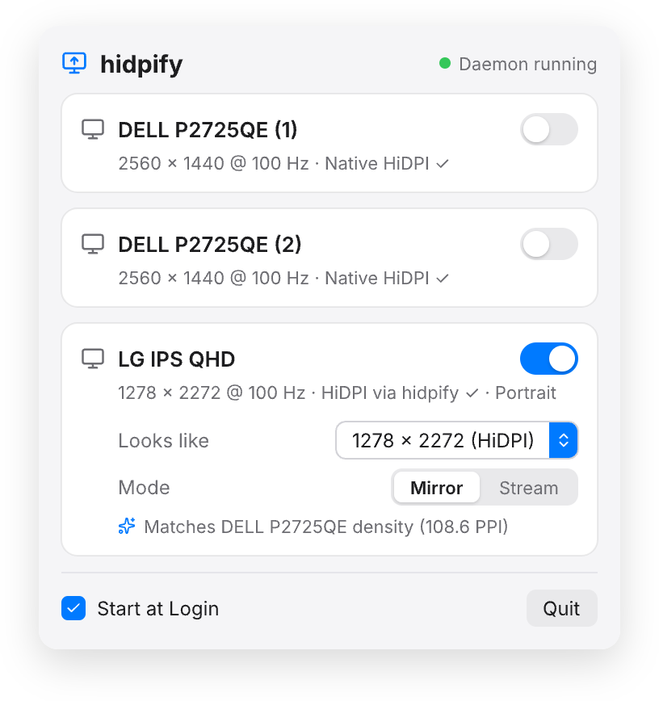
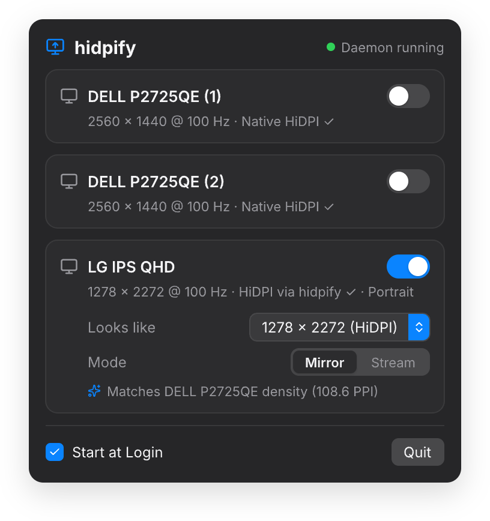

**English** · [한국어](./README.ko.md)


# hidpify

A CLI + resident daemon that forces HiDPI rendering onto external monitors on macOS that don't natively offer a HiDPI mode. It creates a virtual display (via the `CGVirtualDisplay` private API) at the desired resolution and HiDPI, then hardware-mirrors its contents onto the actual monitor — working around the DCP physical-pipe constraints on Apple Silicon (M4, etc.). See [DESIGN.md](./DESIGN.md) for the design background and rationale.

## Build & Install

```sh
swift build -c release          # build only (.build/release/hidpify)
Scripts/install-cli.sh          # build + install to ~/.local/bin/hidpify (recommended)
```

**Always install the CLI/daemon binary via `Scripts/install-cli.sh`.** After copying the binary, the script re-signs it with `codesign --force -s -` — SPM's linker signature is invalidated on copy (it still passes `codesign --verify`, but launchd rejects it at launch with "Invalid Signature"), which sends the daemon into a crash-restart loop. Installing with a plain `cp` leaves the daemon flapping on and off.

## Commands

| Command | Description | Key options |
|---|---|---|
| `hidpify list` | Print a table of connected displays (id, name, resolution, HiDPI status, rotation, virtual/mirror status) | — |
| `hidpify enable` | Apply HiDPI to a target display (create virtual display → mirror → select mode) | `--display <name-substring\|id>`, `--looks-like WxH`, `--hz <Double>`, `--foreground` |
| `hidpify disable` | Remove the applied HiDPI setup (remove from config, restore via daemon restart) | `--display <name-substring>` |
| `hidpify status` | Print config file, LaunchAgent load status, and display table | — |
| `hidpify install-agent` | Install the LaunchAgent — auto-runs the daemon at login | — |
| `hidpify uninstall-agent` | Remove the LaunchAgent | — |
| `hidpify daemon` | Run the resident daemon (normally run by the LaunchAgent instead) | — |

## Quick start

```sh
# 1. Check currently connected displays
.build/release/hidpify list

# 2. Apply HiDPI to the display whose name contains "DP"
.build/release/hidpify enable --display DP

# 3. Confirm the result (HiDPI should now show ✓)
.build/release/hidpify list

# 4. If it looks good, register it permanently so it's applied automatically at login
.build/release/hidpify install-agent
```

If `--display` is omitted, hidpify automatically finds a physical display that isn't in HiDPI mode and switches it to HiDPI at its current logical resolution. If `--looks-like` is omitted, the target's current logical resolution is used as-is; if `--hz` is omitted, the current refresh rate is used.

## Caveats

- **Uses a private API**: Creating the virtual display relies on CoreGraphics' undocumented `CGVirtualDisplay*` classes. A macOS update could change their signature or remove them entirely (the tool checks for the class's existence at runtime and fails gracefully if it's gone).
- **Not App Store-eligible**: Because it uses a private API, it cannot pass App Store review. Use it only as a personal tool.
- **Sleep behavior**: On sleep, the virtual display is detached; on wake, it's recreated with the same identity (serialNum) and mirroring/mode are reapplied. The screen may flicker briefly during this process.
- **A one-off CLI process doesn't hold state**: `CGVirtualDisplay` only exists for as long as the process that created it keeps holding the object. So `hidpify enable` saves the config, then either restarts the daemon to apply it (if a LaunchAgent is installed) or, if none is installed, turns the current process itself into a foreground daemon to keep it alive (Ctrl-C exits and reverts it). Run `hidpify install-agent` if you want the setup to persist permanently.

## Menu Bar App (optional)

| Light | Dark |
|:---:|:---:|
|  |  |

Running `Scripts/make-app.sh` builds via `swift build -c release` and produces `dist/Hidpify.app` (ad-hoc signed). Copy this app to `/Applications` and launch it. From the menu bar popover you can toggle HiDPI per connected display, pick a "looks like" resolution (with density-matching suggestions), check daemon status, and manage Start at Login. The app is a pure frontend — creating the virtual display and mirroring is still handled entirely by the `hidpify` daemon (see DESIGN.md §8.1).

The app provides controls that directly manage the daemon (Start/Stop/Restart in the header) as well as Start at Login. **The daemon must always run from the standalone `hidpify` CLI binary** (e.g. `~/.local/bin/hidpify`), never from the binary embedded inside the app bundle — an ad-hoc-signed `.app`'s embedded launchd binary gets killed immediately by taskgated with "Invalid Signature", sending the daemon into a crash-restart loop (mirroring repeatedly attaching and detaching). So to use the app you must first install the `hidpify` CLI to the standard path (daemon controls and Start at Login stay disabled until it is), and as a consequence it shows up in the Screen Recording permission list under a generic "exec" icon (a trade-off until it ships with a proper Developer ID signature).

## Scaling modes: Mirroring (default, recommended) vs. Streaming (experimental)

- **Mirroring (default, recommended)**: Hardware-mirrors the virtual display onto the physical display. Requires no extra permissions, adds no latency, and is stable. Its only downside is the Spaces-switching limitation described below.
- **Streaming (experimental)**: Keeps the virtual display as an independent extended display and captures/renders its contents onto the physical display in real time. Because it isn't a mirror set, **Spaces-switching gestures work normally**, but it comes with the experimental limitations below, so it's recommended **only when you specifically need Spaces swipe gestures**.

```sh
hidpify enable --display LG --mode stream    # switch to streaming (experimental)
hidpify enable --display LG --mode mirror    # switch back to mirroring (default)
```

**Experimental limitations of streaming mode (know these before using it):**
- **Ghost desktop**: The physical display keeps its own desktop underneath the arrangement (the stream is composited on top of it). It's pushed to an "isolated island" at the bottom of the layout so the cursor can't reach it, but **if you run a full-screen app (e.g. remote desktop) on top of it, its content can leave remnants behind**, and the ghost desktop is visible in Mission Control and full-screen screenshots. It can't be fully removed via public APIs.
- **Screen Recording permission**: The first time you run with `--mode stream`, a permission prompt appears. Allow hidpify under **System Settings > Privacy & Security > Screen Recording**, then run it again. If not granted, it falls back to mirroring.
- **Permission is revoked on rebuild**: Because it's ad-hoc signed, rebuilding the binary changes its cdhash, which invalidates the Screen Recording permission — you'll need to grant it again.
- **Power/GPU cost**: Capturing and compositing a high-resolution backing store in real time is heavier than mirroring (capture is capped at 60fps).

- **Known macOS limitation — Spaces switching on mirror sets**: On a screen that's mirroring a virtual display, you can't switch desktops (Spaces) via trackpad swipe or keyboard shortcuts. The inability to switch Spaces on a mirror set is a known macOS behavior shared with Sidecar, DisplayLink, and AirPlay. **The proper fix is the streaming mode above**; to keep using mirroring, either open Mission Control and click in the Spaces bar at the top, or turn off "Displays have separate Spaces".

## License

[Apache License 2.0](./LICENSE) — © 2026 raeseoklee

## Acknowledgments

- [smcleod.net's analysis of the M4/M5 HiDPI limitation](https://smcleod.net/2026/03/new-apple-silicon-m4-m5-hidpi-limitation-on-4k-external-displays/) — the basis for adopting the virtual-display approach
